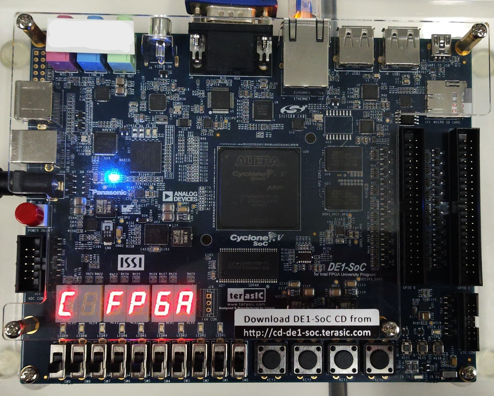
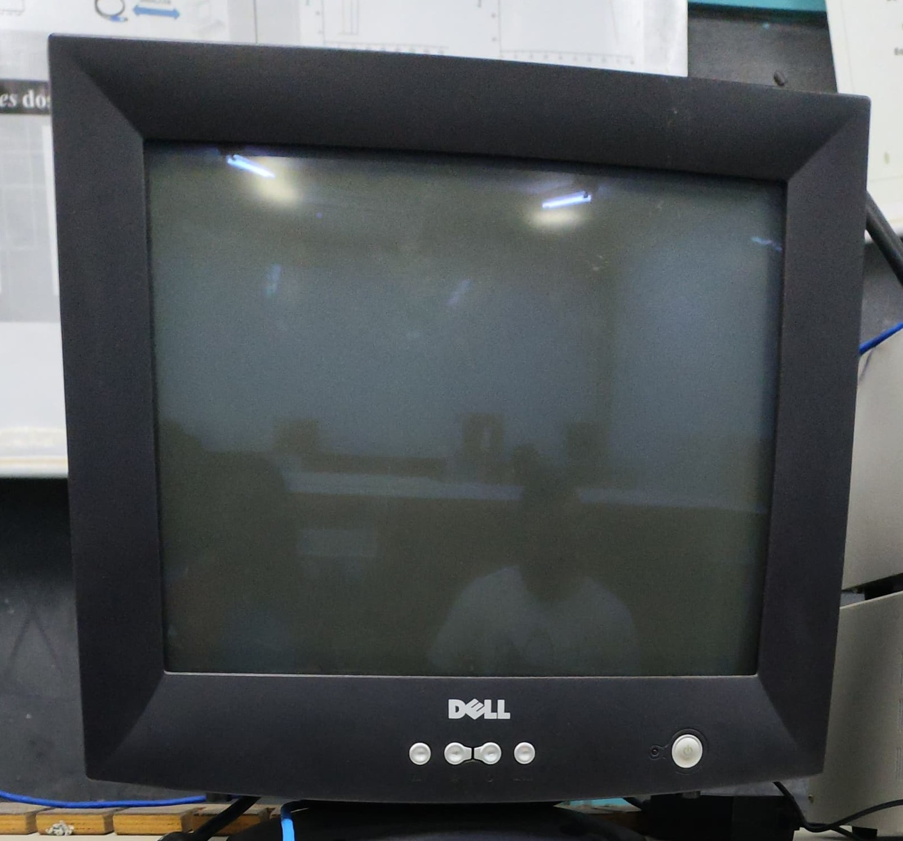
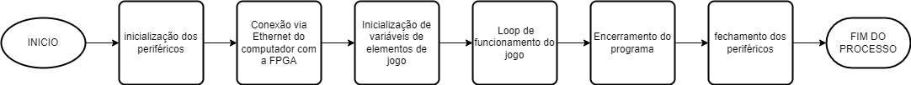
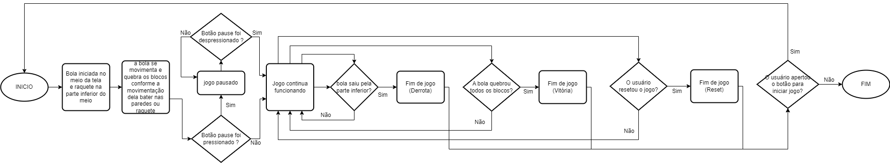

# Projeto de Jogo Brick Break em Linguagem C

## Problema III - TEC499 - MI Sistemas Digitais - 2023.2

Professor: Anfranserai Morais Dias

Grupo: [Antonio Vitor Costa da Silva](https://github.com/avcsilva), [João Vitor Cedraz](https://github.com/JvCedrazC), [Luis Felipe Pereira de Carvalho]() e [Wesley Ramos dos Santos](https://github.com/WesleyRds)

## Seções

1. [Introdução](#introdução)
2. [Hardware Utilizado](#hardware-utilizado)
3. [Software Utilizado](#software-utilizado)
4. [Metodologia](#metodologia)
5. [Testes realizados](#testes-realizados)
6. [Problemas](#problemas)
7. [Documentação Utilizada](#documentação-utilizada)
8. [Execução do Projeto](#execução-do-projeto)

## Introdução

Este documento descreve em detalhes o desenvolvimento de um jogo de colisão e quebra de blocos (nome do jogo inspiração) que utiliza a linguagem C e é implementado na placa de desenvolvimento modelo [DE1-SoC da terasIC](https://www.terasic.com.tw/cgi-bin/page/archive.pl?Language=English&CategoryNo=167&No=836#contents).

O projeto consiste em um jogo em que uma bola colide e quebra o blocos posicionados na parte superior do espaço, o movimento dessa bola é impulsonado por uma raquete na parte inferior que se movimenta na horizontal conforme o usuário movimenta a placa de desenvolvimento, as opções de incio, pause do jogo são acessadas através dos botões e o jogo é exibido em um monitor de tubo.

## Hardware Utilizado

O projeto em questão faz uso de hardware específico para seu desenvolvimento, sendo empregada uma placa de desenvolvimento DE1-SoC da terasIC . Ela é  ideal para diversos projetos de prototipagem e desenvolvimento de sistemas embarcados. Ela combina um FPGA Cyclone V SoC da Intel com um processador dual-core ARM Cortex-A9, oferecendo uma plataforma completa e flexível para implementação de hardware e software. Seu acesso para a execução do jogo é feito através da conexão via FHTTP (ethernet) no terminal de um computador.

### teasIC DE1-SoC - Especificações



| Categoria                               | Detalhes                                       |
| --------------------------------------- | ---------------------------------------------- |
| **FPGA**                          | Cyclone V SoC 5CSEMA5F31C6                     |
| Logic Elements                          | 85K                                            |
| Memória Embarcada                      | 4,450 Kbits                                    |
| PLLs Fracionais                         | 6                                              |
| Controladores de Memória               | 2                                              |
| **Configuração e Depuração**  | Dispositivo de Configuração Serial (EPCS128) |
| On-Board                                | USB Blaster II                                 |
| **Memória**                      | 64MB SDRAM                                     |
| DDR3 SDRAM                              | 1GB                                            |
| Micro SD                                | Sim                                            |
| **Comunicação**                 | 2 Portas USB 2.0                               |
| UART para USB                           | Sim                                            |
| Ethernet                                | 10/100/1000                                    |
| PS/2                                    | Mouse/Teclado                                  |
| IR                                      | Emissor/Receptor                               |
| **Conectores**                    | 2 Headers de Expansão (3.3V)                  |
| Entrada ADC                             | 10 pinos                                       |
| Conector LTC                            | SPI Master, I2C, GPIO                          |
| **Display**                       | VGA DAC 24-bit                                 |
| **Áudio**                        | CODEC 24-bit                                   |
| Entrada de Vídeo                       | Decodificador TV                               |
| **ADC**                           | Taxa de Amostragem: 500 KSPS                   |
| Canais: 8                               |                                                |
| Resolução: 12 bits                    |                                                |
| Range: 0 ~ 4.096 V                      |                                                |
| **Botões, Interruptores e LEDs** | 4 Teclas de Usuário (FPGA)                    |
| 10 Interruptores de Usuário (FPGA)     |                                                |
| 11 LEDs de Usuário (FPGA + HPS)        |                                                |
| 2 Botões de Reset (HPS)                |                                                |
| 6 Displays 7 segmentos                  |                                                |
| **Sensores**                      | G-Sensor                                       |
| **Energia**                       | Entrada DC 12V                                 |

| Categoria                               | Detalhes                                       |
| --------------------------------------- | ---------------------------------------------- |
| **FPGA**                          | Cyclone V SoC 5CSEMA5F31C6                     |
| Logic Elements                          | 85K                                            |
| Memória Embarcada                      | 4,450 Kbits                                    |
| PLLs Fracionais                         | 6                                              |
| Controladores de Memória               | 2                                              |
| **Configuração e Depuração**  | Dispositivo de Configuração Serial (EPCS128) |
| On-Board                                | USB Blaster II                                 |
| **Memória**                      | 64MB SDRAM                                     |
| DDR3 SDRAM                              | 1GB                                            |
| Micro SD                                | Sim                                            |
| **Comunicação**                 | 2 Portas USB 2.0                               |
| UART para USB                           | Sim                                            |
| Ethernet                                | 10/100/1000                                    |
| PS/2                                    | Mouse/Teclado                                  |
| IR                                      | Emissor/Receptor                               |
| **Conectores**                    | 2 Headers de Expansão (3.3V)                  |
| Entrada ADC                             | 10 pinos                                       |
| Conector LTC                            | SPI Master, I2C, GPIO                          |
| **Display**                       | VGA DAC 24-bit                                 |
| **Áudio**                        | CODEC 24-bit                                   |
| Entrada de Vídeo                       | Decodificador TV                               |
| **ADC**                           | Taxa de Amostragem: 500 KSPS                   |
| Canais: 8                               |                                                |
| Resolução: 12 bits                    |                                                |
| Range: 0 ~ 4.096 V                      |                                                |
| **Botões, Interruptores e LEDs** | 4 Teclas de Usuário (FPGA)                    |
| 10 Interruptores de Usuário (FPGA)     |                                                |
| 11 LEDs de Usuário (FPGA + HPS)        |                                                |
| 2 Botões de Reset (HPS)                |                                                |
| 6 Displays 7 segmentos                  |                                                |
| **Sensores**                      | G-Sensor (Acelerômetro)                       |
| **Energia**                       | Entrada DC 12V                                 |

### Monitor de Tubo - Especificações



|            Característica            |      Detalhes      |
| :------------------------------------: | :----------------: |
|       **Tipo de Display**       |      Vertical      |
| **Tamanho da Tela (Horizontal)** |      32,4 cm      |
|  **Tamanho da Tela (Vertical)**  |      24,6 cm      |
|  **Tamanho da Tela (Diagonal)**  |      40,6 cm      |
|      **Varredura Vertical**      |    50 - 160 Hz    |
|     **Varredura Horizontal**     |    30 - 70 kHz    |
|  **Tamanho da Tela (Diagonal)**  |   43,2 cm (17")   |
|          **Dot Pitch**          |  0,270 x 0,270 mm  |
|     **Resolução Máxima**     | 1280 x 1024 pixels |
|    **Resolução do Display**    | 1024 x 768 pixels |

## Software utilizado

Para o desenvolvimento e execução dos códigos, o Visual Studio Code foi utilizado como ferramenta de escrita.

Visual Studio Code (VS Code): é um editor de código-fonte gratuito e de código aberto desenvolvido pela Microsoft. É multiplataforma, altamente extensível, oferece integração com Git, suporte a várias linguagens de programação, ferramentas de depuração integradas e um terminal incorporado.

## Metodologia

### Fluxograma do funcionamento do sistema

O fluxograma abaixo apresenta a maneira como o sistema se comporta de forma geral durante a execução do projeto:



**1. Inicialização:**

* Placa de desenvolvimento (FPGA)
* Monitor CRT
* Computador

**2. Conexão:**

* O computador é conectado à FPGA para execução do jogo.

**3. Inicialização do jogo:**

* São inicializadas variáveis e elementos do jogo através do terminal.
* Inicio da execução do jogo na FPGA.

**4. Jogatina:**

* Segue-se o fluxo do jogo ([Ver imagem fluxograma abaixo](#Fluxograma-do-funcionamento-do-jogo)).

**5. Encerramento:**

* Encerra-se a execução do jogo no terminal caso o usuário não queira jogar novamente.

**6. Desconexão e desligamento:**

* Desconecta-se e desliga-se devidamente os periféricos .

### Fluxograma do funcionamento do jogo

O fluxograma abaixo apresenta a maneira como o projeto do jogo foi elaborado:



O processo de funcionamento do jogo acontece da seguinte forma:

**Início:**

* A bola é iniciada aleatoriamente no meio da tela.
* A raquete é posicionada na parte inferior no meio da tela.

**Movimento da bola:**

* A bola se move livremente pela tela.
* Ao colidir com blocos:
  * Se for no meio do bloco, apenas o bloco tocado é quebrado.
  * Se for na interseção entre blocos, todos os blocos "tocados" pela bola são quebrados.
* Ao colidir com as paredes laterais e superior, o ângulo da bola é modificado.
* Se a bola se direcionar para a parede inferior:
  * O jogador deve movimentar a raquete para mudar o ângulo da bola e fazê-la voltar para cima.
  * Se a bola não for redirecionada pela raquete, o jogo termina.

**Objetivo:**

* Quebrar todos os blocos presentes na tela.

**Pausa, retomada e reinicio:**

* O jogador pode pausar e retomar o jogo a qualquer momento pressionando o botão 1.
* O jogador pode resetar o jogo pressionando o botão 4.

### Solução do Problema

Para a soluição do problema foi utilizada a linguagem de programação C, bem como a utilização da interface de desenvolvimento (IDE) Visual Studio Code, para a elaboração dos códigos fonte. O projeto foi sintetizado utilizando um computador de placa única, o DE1-Soc, ao qual foi conectado um monitor de tubo Dell para exibição do jogo.

#### Bibliotecas utilizadas

Para auxiliar no desenvolvimento do código em C do Jogo foram utilizadas as seguintes bibliotecas: **Stdio**, **Signal**, **Stdbool**, **Intelfpgaup/KEY**, **Intelfpgaup/video** e **Intelfpgaup/aceel**.

```
├── stdio.h
├── signal.h
├── stdbool.h
├── intelfpgaup/KEY.h
├── intelfpgaup/video.h
├── intelfpgaup/aceel.h
```

As bibliotecas **Stdio** **e** **Stdbool** fornecem funções para diversas tarefas em C, como manipulação de entrada/saída, alocação de memória, manipulação de strings, operações de baixo nível em sistemas Unix-like e tipos booleanos.

**Signal:** em C fornece funções para gerenciar sinais em um processo. Sinais são notificações assíncronas enviadas ao processo pelo sistema operacional ou por outros processos. Eles podem ser usados para indicar eventos como:

* **Entrada do usuário:** pressionamento de teclas, cliques do mouse
* **Interrupções de hardware:** divisão por zero, overflow aritmético
* **Terminações de processos:** envio de sinais SIGKILL ou SIGTERM
* **Eventos do sistema:** mudança de tamanho do terminal, recebimento de um pacote de rede

**intelfpgaup/KEY:**  Ela oferece uma API simples e intuitiva para criação de jogos, com funções para gerenciamento de gráficos, som, entrada de dados e muito mais.

**Intelfpgaup/video:**  Ela oferece uma API simples e intuitiva para criação de gráficos, com funções para desenho de sprites, linhas, retângulos, texto e muito mais.

**Intelfpgaup/aceel:** é utilizada para o gerenciamento do sensor G (acelerômetro) presente na placa de desenvolvimento que movimenta a raquete.

### Telas do jogo

Abaixo são apresentadas as telas de inicio, execução do jogo, pausa e fim do jogo com vitória e derrota:

imagens

## Documentação utilizada:

[**Manual de usuário da placa de desenvolvimento DE1-SoC:** ](https://www.terasic.com.tw/cgi-bin/page/archive.pl?Language=English&CategoryNo=167&No=836&PartNo=4#contents)Contém todas as informações relacionadas ao funcionamento da DE1-SoC, bem como são realizadas a integração da placa com demais recursos (video externo e acelerômetro).

## Testes Realizados

Abaixo são apresentados alguns testes realizados com o proposito de verificar o funcionamento do projeto:

imagens

## Execução do jogo

Em posse do código desse repositório e de uma placa de desenvolvimento DE1-SoC conectada a um monitor, para testar o funcionamento do programa, conecte a placa com um computador e execute o seguinte comando no terminal:

```
make all
```

#### [Voltar ao topo](#Projeto-de-jogo-Brick-Break-em-Linguagem-C)
